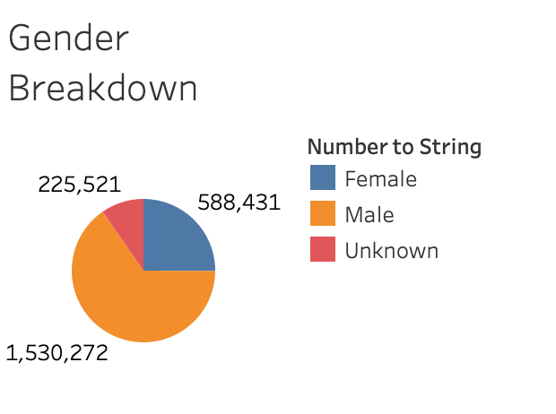

# Bikesharing

## Overview of Project

### Purpose

The purpose of this project was to analyze NYC Citibike data from August 2019 to gain more insight into how a bike-sharing program works.

## Results
The visualizations below depict several results of this analysis.

1.  **Gender Breakdown** - NYC Citibike users are mostly male, with about 65% being male and about 25% being female.

2. **Peak Hours** - Trips increase throughout the day, with peak morning hours around 8am and peak afternoon hours from 5pm to 6pm.

3. **Trips by Weekday** - On weekdays, the most bikesharing trips occur in the morning around the 8am hour and in the afternoon from 5pm to 7pm. On weekends, trips are more evening distributed throughout the day.

4. **Trips by Gender** - The image below reflects the same conclusions as point 3. While there are more customers between both genders during these time frames, there are noticebly more male than female customers. This mirrors the conclusion in point 1 where there are about 2.5 more male than female customers.

5. **Trips by Gender by Weekday** - For the most part, regular customers have a fairly equal trip distribution between genders. Subscribing customers, on the other hand, are primarily male with the most trips occuring on Thursdays and Fridays.

6. **Checkout Times by Users** - The vast majority of checkout durations are less than an hour, with the most customers checking out bikes for around ten minutes.

7. **Checkout Times by Gender** - Both male and female customers more commonly checkout bikes for around 10 to 15 minutes. Customers of unknown gender range from the 10 to 25 minute checkout marks.

## Summary

Based on the August 2019 NYC Citbike bikesharing data, we see that bikesharing is most popular with the male population and are most utilizted during the hours where most people are presumably going to and from work.

### Additional Visualization Suggestions
For future analyses, the below visualizations are suggested:
1. Customer ages by hour and day of the week
2. Customer checkout times by age